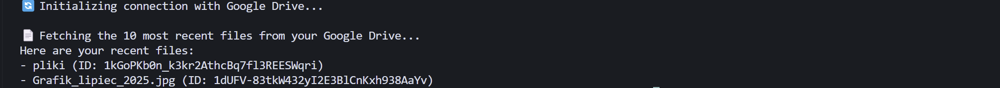
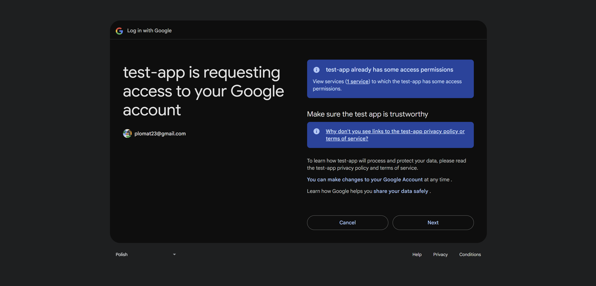

# Google Drive File Lister

A console application in Python for authorizing and displaying recent files from a Google Drive account using the Google Drive API.

---

## Key Features

-   Secure OAuth 2.0 authorization with the Google API, featuring automatic token saving and refreshing.
-   Fetching and displaying a list of the 10 most recently modified files from the user's account.
-   Handles API connection errors and presents the results clearly in the console.

---

## Tech Stack

### Console Application
-   **Language:** Python
-   **Libraries:** google-api-python-client, google-auth-oauthlib, google-auth-httplib2

### Consumed API
-   **API:** Google Drive API v3
-   **Protocol:** REST
-   **Authorization:** OAuth 2.0

---

## Screenshots

*Given the nature of the application (a console tool), the screenshots show the terminal during program execution.*

**View after successful authentication and file fetching:**


**Browser authorization process:**


---

## Setup and Run

1.  Clone the repository:
    ```bash
    git clone [REPOSITORY_URL]
    ```
2.  Navigate to the project directory:
    ```bash
    cd google_drive
    ```
3. Create Google API Credentials
This application requires you to have your own Google API credentials.
Create a credentials.json file from the Google Cloud Console and place it in the project's root directory.

<details>
<summary>Step-by-step instructions on creating credentials.</summary>

- Creating OAuth Credentials in Google Cloud Console
- Go to the Google Cloud Console.
- If you haven't already, create a new project or select an existing one.
- In the left-hand menu, go to:
    APIs & Services → Library
- Search for Google Drive API and enable it.
- Then go to:
    APIs & Services → Credentials
- Click "+ CREATE CREDENTIALS" → select OAuth client ID.
    If prompted to configure the OAuth consent screen, do so:
        Choose "External".
        Fill in the required fields (you can skip scopes and test users for now).
- Under Application type, select "Desktop app".
- Name the client (e.g., Drive Lister) and click Create.
- Click Download JSON — save the file as credentials.json in the root directory of your project.
</details>

Important: The credentials.json file contains private keys. Never commit it to GitHub. Make sure your .gitignore file includes entries for credentials.json and token.json.

```bash
# .gitignore
credentials.json
token.json
```

4.  Install dependencies:
    ```bash
    pip install -r requirements.txt
    ```
5.  Run the application:
    ```bash
    python main.py
    ```
    On the first run, you will be redirected to your browser to authorize access to your Google account.

---

## API Documentation

This application acts as a client for the public **Google Drive API v3**. The primary endpoint used is:

-   `GET https://www.googleapis.com/drive/v3/files`
    -   **Description:** Used to retrieve a list of files and folders from the user's drive.
    -   **Parameters Used:**
        -   `pageSize=10`: Limits the number of results to 10.
        -   `fields="files(id, name, webViewLink)"`: Defines the returned fields for each file, minimizing the amount of transferred data.
        -   `orderBy="modifiedTime desc"`: Sorts the results from newest to oldest based on the modification date.
